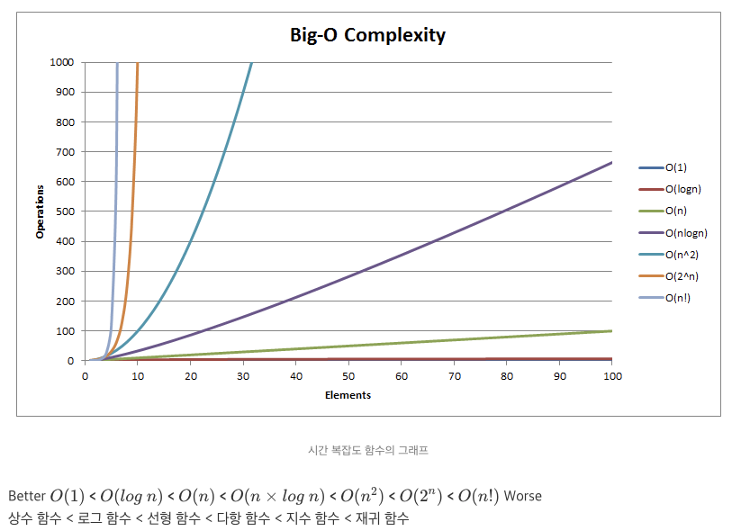
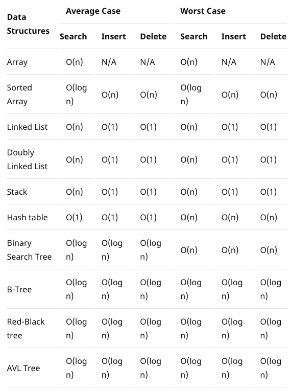

해싱이 뭔가요?

    - 키 값에 산술적인 연산을 통해 저장되어 있는 테이블의 주소를 계산하여 항목에 접근
    - 키 값 연산에 의해 직접 접근이 가능한 구조를 해시 테이블이라고 부른다.
    - 해시 테이블을 이용한 탐색을 해싱이라고 함
    - 해시 테이블은 뭔가요?
        - 데이터를 저장하는 자료구조 중 데이터를 빠르게 검색할 수 있는 자료구조
        - 내부적으로 배열을 사용하여 데이터를 저장하기 때문
        - 해시 테이블은 Key 값에 해시함수를 적용해 배열의 고유한 index를 생성
            - 이 index를 활용해 value를 저장 및 검색하게 된다.
            - 여기서 value가 저장되는 장소를 버킷 또는 슬롯이라고 한다.
        - 이 때, 키 값간에 충돌이 발생할 수 있다. 그럴때 Chaining, Open Address 방식으로 해결할 수 있다.
            - Chaining: 해싱된 모든 키들을 하나의 연결리스트로 저장
            - Open Addressing: 모든 키들을 해시 테이블에 저장. 이때 테이블의 각 칸에 1개의 키만 저장. 충돌날 시 충돌난 인덱스에서 충돌 해결 기법을 통해 해결
        - 균형 이진 탐색 트리로도 구현 가능. 그럼 이 때 탐색 시간은 O(logN)이 걸림.
    - [자바에서 지원하는 해시맵](https://www.notion.so/JAVA-77d78085062d4c188a9d89346acebc1e)

스택, 큐

    - 스택: 세로로 된 바구니와 같은 구조로 먼저 넣은 데이터가 마지막으로 나오게 되는 FILO 구조
        - 1, 2, 3, 4 순서대로 스택에 삽입된다고 했을 때, 나오는 순서는 4, 3, 2, 1이 된다.
        - 예로 함수를 재귀적으로 호출하면 호출 스택이 생긴다.
    - 큐: 가로로 된 통과 같은 구조에 데이터를 넣는 구조로서, 먼저 넣은 데이터가 가장 먼저 나오는 FIFO 구조
        - 1, 2, 3, 4 순서대로 스택에 삽입된다고 했을 때, 나오는 순서는 1, 2, 3, 4가 된다.

PriorityQueue 동작 원리가 어떻게 되나요?

    - 우선순위 큐는 가장 우선순위가 놓은 데이터를 먼저 꺼내기 위한 자료구조
    - 일반적으로 힙으로 구현되었고, 힙은 완전이진트리이기 때문에 삽입, 삭제 시간복잡도는 O(logN)입니다.
    - 최대힙, 최소힙으로 나눌 수 있고. 힙으로 구성된 이진트리는 모든 정점이 자식 요소보다 우선순위가 높다는 성질을 가지고 있음.

ArrayList와 LinkedList의 차이점은 뭔가요?

    - ArrayList는 데이터들이 순서대로 늘어선 배열
    - LinkedList는 자료의 주소값으로 서로 연결된 형식
    - ArrayList
        - 원하는 데이터에 무작위로 접근할 수 있다.
        - 리스트의 크기가 제한되어 있고, 리스트의 크기를 재조정하는 것은 많은 연산을 필요
        - 데이터의 추가/삭제를 위해서는 임시 배열을 생성 후 복제해야함
    - LinkedList
        - 리스트의 크기에 영향 없이 데이터를 추가할 수 있음
        - 데이터를 추가하기 위해 새로운 노드를 생성하여 연결하기 때문에 추가/삭제 연산이 빠름
        - 무작위 접근이 불가능하고, 순차 접근만 가능.

Array와 ArrayList의 차이점은 뭔가요?

    - Array는 고정 길이입니다. 주어진 배열을 모두 채운 상태에서, 새 데이터를 추가하고 싶으면 새로운 배열을 만들어줘야 합니다.
    - ArrayList는 가변 길이입니다. 하지만 내부적으로 배열로 구성되어 있고, Default로 10개 공간을 가지고 생성됩니다.
        - capacity 인스턴스 변수를 가지고 있고 요소들이 더해지면 ArrayList의 capacity 또한 자동적으로 늘어남
        - 설정된 capacity를 넘어서 더 많은 객체가 들어오면, 배열 크기를 1.5배 증가시킨다.

Java Collection

    - List
        - ArrayList: 자바의 Vector를 개선한 배열로 구현한 List. 데이터가 저장된 순서가 같다.
        - LinkedList: 다음 노드의 주소를 기억하고 있는 List. 탐색의 경우 첫번째 노드부터 탐색해 나가기 때문에 느리지만, 삽입과 삭제는 간단하다.
    - [Map](https://www.notion.so/JAVA-77d78085062d4c188a9d89346acebc1e)
    - Set
        - HashSet: HashMap에서 Key값이 없는 자료형. 집합이라고 생각해도 무방. 순서를 보장하지 않으며, 중복값을 허용하지 않는다. Set중에는 가장 많이 사용
        - TreeSet: Red-Black Tree 자료구조를 사용한 Set
        - LinkedHashSet: LinkedList로 구현된 HashSet. 순서를 보장한다.

자료구조 시간 복잡도

<!--img src='./images/시간복잡도_그래프.png' align="center" />

정렬 알고리즘 시간&공간 복잡도

    

